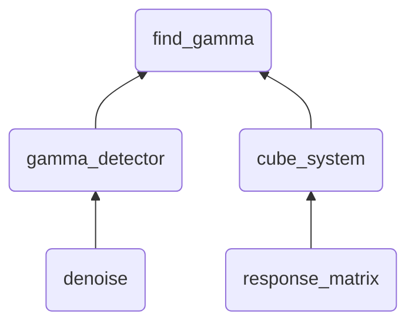

# GRID2
---
<!--为了更好的阅读体验，建议阅读PDF文件-->

[TOC]

---
快速复现说明：
	请使用 `make` 命令，并保证测试的数据集位于 `/data` 目录下，且格式相同

***
## 任务思路说明
对于伽马暴寻源任务，任务被分为以下模块进行：[^11]
	1. 伽马暴事件检测结果（含噪声）的读入，伽马信号的分离与复原
	2. 伽马暴事件中卫星系统信息的载入与准备
	3. 多角度模拟伽马信号输出并根据实际信号判断伽马源的方向
以下将详细阐述各个模块的要点。


### 1. 伽马信号的读入与复原
<!--edited by DM0U-->

* **伽马信号的快速读入**
	此任务是运行时间优化的重点。
	对于单次事件的读取，每次需要将总计  $7 \times 4 = 28$ 个探测器上的光子信息同时按照能道与时间间隔进行归类。为了避免时间的开销，应当充分利用 `numpy` 数组的特性，尽量减少 `for` 循环语句的使用。
	在读入操作中，将先确定28个探测器上探测事件的最长共同时间间隔，并以此确定本次事件的共同时间轴。
	之后则对每个探测器能道上的光子进行计数。采用数组的 `bool` 判断并求和来获得需要单光子事件所属的能道与时刻，并用 `numpy.add.at` 实现高速加法。
	由于 io 操作会十分耗时，而单次事件的数据量相对内存而言很小，故应将 `.h5` 文件中单次事件的原始数据完整读入至内存，之后再做进一步分类。
	最终，该任务在本地笔记本上的平均耗时约为 1.5 秒。[^5]
* **降噪处理**
	由于本底以及高能段光子数过少的情况的影响，直接获得的时间-能道-能量图中的曲线将十分不稳定，并非真实的伽马信号。要获得真实的伽马信号，必须去除本底的干扰，从而正确锁定伽马信号对应的真正时段。
	在实际操作中，进行以下处理：依据每个探测器最低能道[^6]的能量变化数据，判断伽马信号的发生时刻、开始时刻与结束时刻。对同一探测器的每个能道，以始末时刻内的平均能量减去本底的平均能量，即作为本次事件中所输出伽马信号的强度。
	1. 最低能道信号的降噪处理
		即使在最低能道，本底的影响也十分强烈。但由于本底的随机性，其往往对应的是高频成分。因此，采用傅里叶变换，截断高频项、保留低频项后，将能成功获得一条平滑的曲线。由此完成初步降噪的过程。
		最初采用的另一种思路是对每个入射的光子，将其作为一个高斯波包弥散开，并保证波包的总面积对应光子能量。但这种方法对某些情况的效果并不好，且在物理上不如傅里叶变换截断高频项直观。
	2. 伽马信号峰的判断
		对于平滑化的曲线，将其能量刻度整体平移使得能量刻度为0处对应其均值。默认取能量曲线的最高点对应时刻为信号发生时刻，取最高点两侧能量刻度0处对应的位置为信号的始末时刻。
		由于存在未探测到信号或伽马信号过弱的可能，记录能量最大值与标准差的比例，作为是否检测到信号的判据。[^7]另外，认为同一个卫星不同探测器上伽马暴的入射时间应该是同样的。因此，若同卫星上两个探测器所测的伽马暴时刻差过大，则只信任最大峰更高[^8]者。
		对于始末时刻的判断，这里仿照光学中半角宽的概念，以波峰下落至平均能量强度为始末时刻的特征。[^9]
	3. 去除本底
		为了得到真实的伽马信号，对同一探测器的每个能道，以始末时刻内的平均能量减去本底的平均能量。在这里的处理中，取各能道中总时长中的平均能量强度为本底信号的强度，而不采用给定的本底数值。
		在没有伽马信号时，卫星信号即对应本底信号。考虑到伽马暴的发生时刻相对总探测时长很短，认为总时间内的平均强度即对应本底强度，这样的处理相对采用给定数值的方法而言更为灵活。[^10]


### 2. 卫星系统信息
<!--edited by DM0U-->
伽马源位置的判断依据不同方位入射时卫星系统的不同响应。为此，需要处理不同入射方向是的卫星响应特性。
这里的特性包含3类，分别对应探测器响应矩阵、卫星是否会被遮挡、卫星接受信号的时延。

* **响应矩阵计算**
	在原始数据中，只给出卫星 $7\times 12$ 个方位的响应矩阵。为此，采用双线性插值，计算 $(\theta, \phi)$ 方向入射的能量对应的响应矩阵[^1]。
* **遮挡的处理**
	对于遮挡情况，只需要满足卫星与地心相对伽马暴方向的垂距不足地球半径且相对位于地球后侧即可。为了模块的统一化操作，在查询响应矩阵时，对被遮挡的卫星将返回对应规模的0矩阵。
* **信号时延**
	采用卫星相对地心位置的时延进行记录。[^12]

### 3. 输入模拟与伽马信号源的判定
<!--TODO-->
对于伽马暴事件，将其分为以下三种情况分别处理：
1. 有两个及以上的卫星测得明显信号；
2. 只有一个卫星测得明显信号
3. 所有卫星上均未测得明显可分辨的信号
<!--TODO-->

***
## 代码文件与运行体系说明
如下图，为文件的运行结构：

其中，`gamma_detector` 模块即对应第一项任务，伽马信号的读入与复原； `cube_system`则对应卫星系统信息。`find_gamma`则依据前两项任务的处理结果，进行最终的判断。对于前两项子任务的处理结果，分别以 `gamma_event` 类与 `cube_system` 类实现封装。
`denoise` 中提供以傅里叶变换消除曲线高频抖动下的方法 `denoise_curve_by_fft`，`response_matrix` 类中提供 `get_Response_Matrix` 方法计算相对卫星入射方向的响应矩阵。所有的基础实现均进行矢量化运行。

### `find_gamma.py`: ???
<!--TODO:?-->


### `gamma_detector.py`: 伽马信号的读入与复原
<!--edited by DM0U-->
此为信号处理模块，根据探测器上的信号分析实际的伽马信号内容。此模块实现基类 `gamma_event` ，它在初始化时根据指定路径与事件名读取信号记录，并进行初步分析得到实际伽马信号的输出强度。提供 `Eng_out_gamma_all`, `Eng_out_rate`, `Id_happen` 等内部变量分别对应每个探测器每个能道的平均伽马信号强度，卫星上所认为的伽马信号强度相对噪声信号的强度比例，信号发生时刻索引值等若干伽马信号信息。
另外，该函数为程序的主要时间优化目标[^5]。


#### `denoise.py` :  对最短能道的光变曲线做降噪处理
<!--edited by DM0U-->
依据每个时刻数据点的高斯波包扩散或傅里叶变换截断高频项的方法，对波包特征明显的尖锐曲线[^3]进行平滑化处理。


### `cube_system.py`：卫星坐标处理，响应特性的获得
<!--edited by DM0U-->
此为卫星处理模块，基于直接的笛卡尔坐标系的矢量进行运算。此模块中实现基类 `cube_system` ，它在初始化时根据指定路径与事件名读取卫星信息，并以此实现响应特性的计算。提供对外函数接口 `cal_time_delay`, `get_response`,  `check_not_blocked`，分别返回对应入射方向下的时延，响应矩阵与遮挡情况。


#### `response_matrix.py`:  响应矩阵的读取与计算
<!--edited by DM0U-->
该程序基于双线性插值算法，针对 $7\times 12$ 的响应矩阵，利用双线性差值计算 $(\theta, \phi)$ 方向入射的能量对应的响应矩阵[^1]。
函数 `get_Response_Matrix(theta, phi, method)` [^2] 返回对应对应4个探测晶体的响应矩阵，规模 `(4, Engin, Engout)`。
（此模块不应该被外部调用）


<!--TODO:DEL-->
### `response_matrix_test.py`:  检验响应矩阵读取模块`response_matrix.py`的正确性
该文件并非研究中需要直接使用的文件，默认置于`tool`文件夹中作为备份。需要使用时请将其移至根工作目录。
模块功能:
1. 响应矩阵重新分割的检验
2. 双线性算法正确性的简单验证
3. 批量输入 $\theta$ 与 $\phi$ 时矢量化模块的正确性验证(对拍程序) 

---

## 最小二乘法反推输入能道的方法

考虑矩阵
$$
Ax=b
$$
其中 $x, b$ 为列向量，$A$ 为变换系数矩阵。$A, b$ 已知，尝试求解 $x$ 。
若 $A$ 的行数大于列数，此时 $x$ 一般不存在解（且非特例情况[^4]下不会有多重解）。那么，此时 $x$ 的最佳取值可依据最小二乘法决定。在几何意义上而言，这等效于先将 $b$ 投影至矩阵 $A$ 的列空间得 $b'$ ，之后求解线性方程组 $A x = b' = Pb$ 。

投影矩阵 $P$ 满足
$$
P = A (A^{T} A)^{-1} A^{T}
$$
考虑 $A$ 的QR分解，
$$
\begin{align}
\because& A = Q R,\,Q^{T} Q = I\\
\therefore& P = A (A^{T} A)^{-1} A^{T} = A (R^{T} Q^{T} Q R)^{-1} R^{T} Q^{T} = A (R^{T} R)^{-1} A^{T}\\
\because& Ax = Pb = A (R^{T} R)^{-1} A^{T} b\\
\therefore& x = (R^{T} R)^{-1} A^{T} b
\end{align}
$$
对应代码
```python
Q, R = np.linalg.qr(A)

L = np.linalg.inv(np.matmul(R.T, R))
L = np.matmul(L, A.T)
x = np.matmul(L, b)
```


对于预设的入射方向，可以得到对应响应矩阵 $RM$ ，要求 
$$
Eng_{in} RM = Eng_{out}
$$
即
$$
RM^{T} Eng_{in}^{T} = Eng_{out}^{T}
$$

---
[^1]: 由于响应矩阵的得出基于蒙特卡洛模拟，故即使 $\theta=0$ ，针对不同的 $\phi$ 也可能有不同的响应矩阵。此处的处理是认为这些差异很小，不进行进一步的修正。
[^2]: `method` 字符串类型，可选值 `'float'`, `'array'` ，分别对应不同的输入类型
[^3]: 由于高能道的本身有效光子数过小，故只可对最低能道进行处理。
[^4]: $A, b$ 均为 $\bold{0}$ 矩阵
[^5]: 取100次初始化事件，对应501至600号测试样例，最终耗时150秒。
[^6]: 在高能道处，光子的入射事件变得十分稀疏，但同时一旦发生又携带有大量的能量。导致其曲线只有几个时刻忽然的突变，偶然性很大，不适合作为伽马信号入射的判断依据。
[^7]: 此判据的具体使用留至最终分析。因为本任务中初步分析过程的原则是除了必要的判断，其它信息都应该保留。在同样的原则下，初步分析时保留7个卫星上28个探测器的各自的信息记录。
[^8]: 指（最大能量强度 - 平均能量强度）/ 标准差
[^9]: 另一种想法是峰两侧下落斜率最大处为始末时刻
[^10]: 这种方法下高能道处可能会出现负值，因为高能道光子数太少，偶然性很强。处理时保留这些负值，因为最终对高能道的处理是将若干能道强度相加以减少其偶然性因素，故这些负值再相加后也能正确反应高能道的强度
[^11]: 为了程序的灵活性与可拓展性，前两个任务应当尽量保留更多可用的信息（如分布保留每个卫星4个探测器上的信息）
[^12]: 实际程序中并未用到。因为当有两个及以上的卫星收到明显信号时，已经不需要时延信息也能很好的定位伽马源